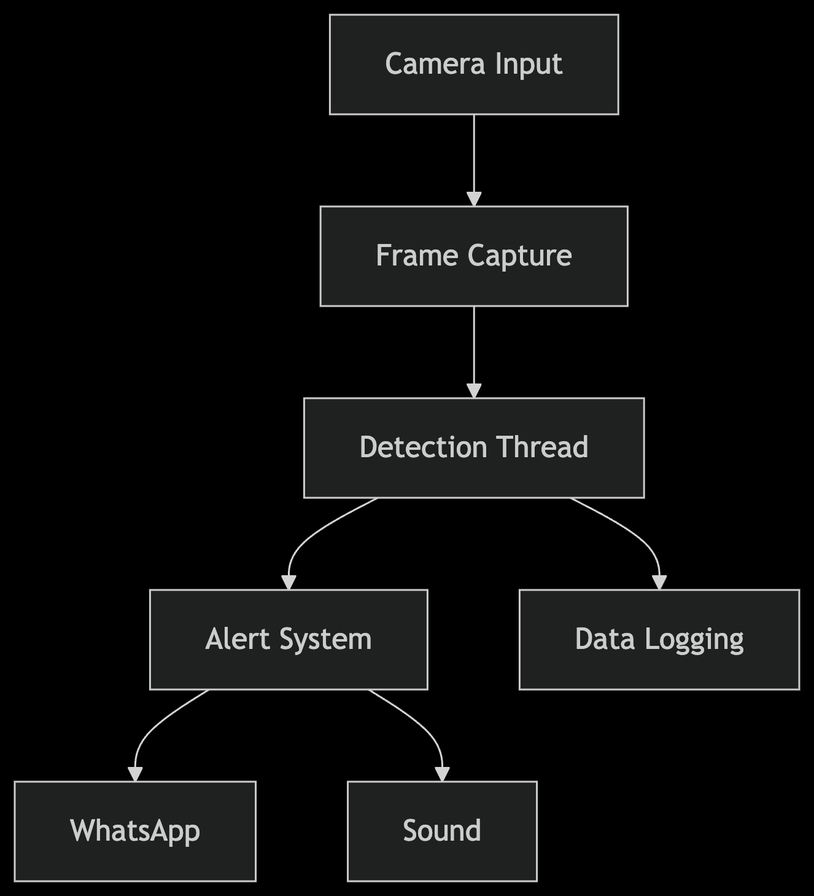

# Nirikshon: Real-Time Object Detection System

**Author**: Imtiaz Khandoker
**Email**: czar.imtiaz@gmail.com
**GitHub**: [@1mt142](https://github.com/1mt142)

  
_Figure 1: System Architecture Overview_

This system utilizes an HD camera and AI-powered object detection to identify harmful or unexpected objects in different environments using trained data models. It operates in two modes:

1. Household or Ground-Level Security:
   The system can detect threats such as intruders or even stray animals like dogs entering a restricted area (e.g., your home, backyard, or office premises). When a threat is identified through the camera, it captures an image and sends a real-time alert — including the image — to your WhatsApp or other preferred communication channels.

2. Sky Protection:
   For aerial threats, such as missiles or flying objects, the system uses the HD camera to perform real-time detection. Upon identifying a potential airborne threat, it captures the image and sends an alert. Following detection, a radar module is activated to continuously track the object’s movement in the sky, enabling enhanced surveillance and threat monitoring.

By combining AI with visual and radar-based tracking, the system ensures flexible protection for both ground-level and sky-based security threats.

### How It Works

1. **Detection**: The system continuously analyzes video feeds for objects using predefined detection models.
2. **Capture**: Once a object is detected, the system captures an image of the object.
3. **Notification**: The captured image is sent instantly to your WhatsApp via a pre-configured session.

### Setup

Ensure your detection model includes harmful objects and is properly configured. Set up WhatsApp Web integration as per the installation instructions.

## 📌 Table of Contents

- [Features](#-features)
- [Installation](#-installation)
- [Configuration](#-configuration)
- [Usage](#-usage)
- [Technical Details](#-technical-details)
- [Troubleshooting](#-troubleshooting)

## 🌟 Features

### Core Functionality

- Real-time object detection using YOLOv8
- Multi-threaded processing for smooth performance
- YOLO model
- Configurable target object detection
- Confidence threshold filtering

### Alert Systems

- WhatsApp instant notifications
- Local sound alerts (.mp3)
- Visual on-screen counters

### Camera Support

- Built-in webcams
- IP cameras (RTSP/HTTP)
- Auto-fallback to available sources

### Data Management

- Automatic snapshot saving
- Organized detection archive
- Timestamped evidence logging

## 🛠 Installation

### Prerequisites

- Python 3.8+
- OpenCV-compatible camera
- WhatsApp Web session

### Setup Steps

```bash
# Clone repository
# Nirikshon: Real-Time Object Detection System
1mtgit clone https://github.com/1mt142/nirikshon_ai.git
cd nirikshon_ai

# Create virtual environment
python -m venv venv

# Activate environment
# Windows:
.\venv\Scripts\activate
# Linux/Mac:
source venv/bin/activate

# Install dependencies
pip install -r requirements.txt
```

## 🤝 Contributing

Pull requests are welcome! For major changes, please open an issue first.
